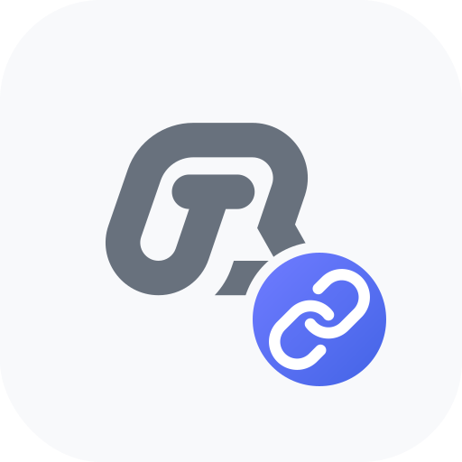

# BiBi IME Bridge

**说点啥的独立 LSPosed / LSPatch 桥接模块**

让悬浮球通过当前第三方输入法预览与回填识别文字，也可在兼容输入法底部长按录音。

简体中文 | [English](README_EN.md)

[下载安装](#-下载与安装) • [使用文档](https://bibidocs.brycewg.com/advanced/ime-bridge.html) • [说点啥主仓库](https://github.com/BryceWG/asr-keyboard)

> **进阶功能**：模块会在选定的第三方输入法进程中运行，需要 LSPosed 或 LSPatch。请只从本仓库 Releases 下载，并将作用域限制为实际需要桥接的输入法。

## ✨ 能做什么

| 能力 | 说明 |
| ---- | ---- |
| 悬浮球文字回填 | 由当前第三方输入法直接向输入框提交最终识别文字 |
| 流式预览 | 支持时以组合文本显示中间结果，结束或取消时正确收尾 |
| 键盘显隐检测 | 由输入法自身报告面板状态，可减少对无障碍检测的依赖 |
| 输入法内录音 | 长按第三方输入法底部的桥接区域录音，松手后交给说点啥识别 |
| 剪贴板特权读写 | 在目标输入法进程内读写系统剪贴板，供 SyncClipboard 在非主键盘场景下同步 |
| 输入框上下文辅助 | Pro：在启用相关 AI 后处理选项时读取光标附近文本作为参考 |

模块本身**不执行 ASR 或 AI 后处理**。录音、供应商选择、备用引擎、识别历史、SyncClipboard 网络请求和最终后处理仍由说点啥负责。

剪贴板同步依赖目标输入法进程存活；键盘被系统回收后，监听与写入会暂停，直到再次打开该输入法。

## 📋 使用前准备

- Android 8.0（API 26）或更高版本
- 最新版[说点啥](https://github.com/BryceWG/asr-keyboard)开源版或 Pro 版
- 已配置可用的 ASR 供应商
- 以下环境二选一：
  - 已安装并启用 LSPosed 的 root 设备
  - 可使用 LSPatch 修补第三方输入法 APK 的设备
- 目标输入法应基于标准 Android `InputMethodService`；部分高度定制或有完整性校验的输入法可能不兼容

「目标输入法」是你平时实际使用、希望接收说点啥结果的第三方键盘。LSPosed 作用域应勾选它，而**不是**说点啥本体。

## 📦 下载与安装

### 下载

1. 打开本仓库 [Releases](https://github.com/BryceWG/bibi-keyboard-lsposed-bridge/releases/latest)
2. 下载最新版本 APK
3. 安装后应用名为 **BiBi IME Bridge** / **BiBi 输入法桥接**

建议同时更新说点啥与本模块。旧模块可能仍可完成文字回填，但不会上报输入法内录音、剪贴板或输入上下文等新能力。

### 使用 LSPosed

1. 安装本模块 APK
2. 打开 LSPosed 管理器并启用 **BiBi IME Bridge**
3. 进入模块作用域，**只勾选**需要桥接的第三方输入法
4. 不要把说点啥开源版或 Pro 版本体加入作用域
5. 强制停止并重新打开目标输入法；如仍未生效，请重启设备
6. 将目标输入法切换为当前键盘，再到说点啥刷新桥接状态

不要勾选「系统框架」或无关应用。扩大作用域不会增加功能。

### 使用 LSPatch

1. 在 LSPatch 中选择需要桥接的第三方输入法 APK
2. 将本模块作为嵌入模块进行修补
3. 安装修补后的输入法，并将其设为当前键盘
4. 更新第三方输入法后，需要使用新版 APK 重新修补

> LSPatch 会改变 APK 签名；LSPosed 模块可能导致系统不稳定。操作前请备份输入法配置，并确保有救砖能力。

## 🚀 在说点啥中启用

1. 打开 `设置 → 界面与交互 → 悬浮球设置`
2. 开启「输入法桥接文字回填」；如需底部录音，再开启「在桥接输入法内录音」
3. 点进普通文本框并保持目标输入法打开
4. 点击「输入法桥接状态」刷新检测结果
5. 确认状态中显示正确的目标输入法，并且存在活动输入连接

启用后，悬浮球识别结果会优先通过目标输入法自身写入。若桥接暂时未就绪，说点啥仍可尝试无障碍写入或剪贴板兜底。

密码、支付等敏感输入框会被模块主动阻止，属于正常的安全行为。

更完整的步骤、录音区域调整与故障排除，请见：[IME Bridge 使用文档](https://bibidocs.brycewg.com/advanced/ime-bridge.html)

## 🔒 权限与隐私

- 保持最小作用域，只从本仓库正式 Releases 安装
- 普通文字回填不会读取输入框已有内容
- Pro 输入上下文仅在明确开启后读取有限的光标附近文本，并对敏感输入框失效关闭
- 输入法内录音由目标输入法进程采集后发送给说点啥
- SyncClipboard 凭证与 HTTP 请求仍在说点啥本体；模块只负责本机剪贴板读写
- 模块不自行保存或识别音频，也不执行 AI 后处理

## 🛠 开发说明

本仓库是独立的 Gradle 工程与 git 仓库，不包含在说点啥主仓库的 `settings.gradle.kts` 中。主应用不依赖 Xposed API；本模块仅在被 Hook 的第三方输入法进程内运行。

- 包名：`com.brycewg.asrkb.imebridge`
- 最低系统版本：Android 8.0（API 26）
- 发布产物请通过本仓库 Releases 分发，不要把 APK 提交进主仓库或本仓库源码树

## 🔗 相关链接

- [说点啥（开源主仓库）](https://github.com/BryceWG/asr-keyboard)
- [使用文档（中文）](https://bibidocs.brycewg.com/advanced/ime-bridge.html)
- [使用文档（English）](https://bibidocs.brycewg.com/en/advanced/ime-bridge.html)
- [官方网站](https://bibi.brycewg.com)
- [Telegram 群组](https://t.me/+UGFobXqi2bYzMDFl)
